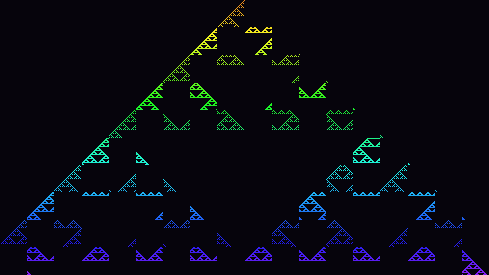

# Cellular Automaton

Wolfram Rule 90 — a one-dimensional binary cellular automaton — is evolved for 540 generations from a single active center cell. Each row is one generation; the deterministic rule (each cell becomes the XOR of its two neighbors) produces the Sierpinski triangle fractal through pure iteration. Color transitions from amber at the apex to violet at the base, making computational time a visible dimension of the work.
