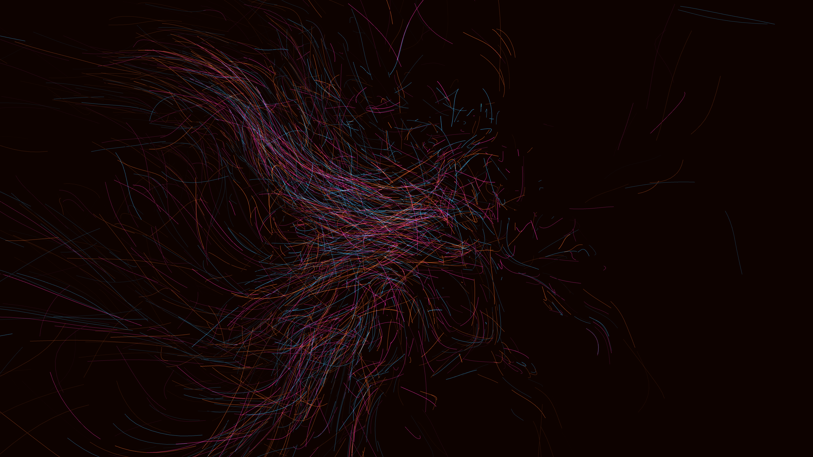

# chaotic_data_galaxy_curl_field_3d

## Details
- **Date**: 2026-06-07
- **Theme**: A swirling, chaotic galaxy of abstract data points coalescing into geometric shapes and then exploding.
- **Technique**: Particle system with 3D Perlin noise simulated curl fields, drawing additive blended lines and points.
- **Palette**: Obsidian background, fiery orange, hot pink, and icy blue.

## Media

