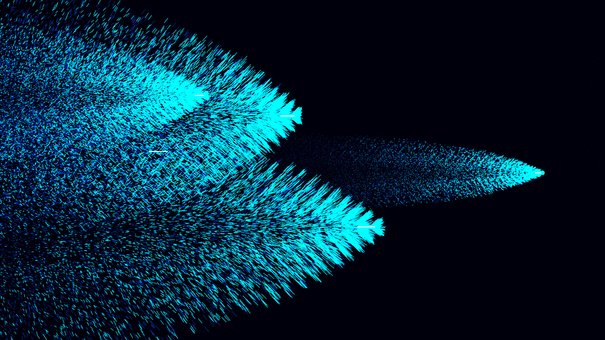

# cherenkov_radiation_cone

## Metadata
- **Date**: 2026-05-10
- **Theme**: Cherenkov radiation, particle accelerators, sonic boom of light, nuclear reactors.
- **Technique**: High-velocity particle tracks traversing a dielectric medium. When a particle exceeds the local phase velocity of light, it triggers an expanding conical shockwave of photons (Cherenkov angle). Vectorized simulation with 120,000 particles using P3D and intense additive blending.
- **Logic Lab Reference**: None

## Concept
Ghostly, high-speed projectiles streak through a pitch-black void, leaving behind overlapping, glowing blue conical shockwaves that slowly fade, resembling a beautiful and eerie underwater reactor core.

## Technical Details
- **Renderer**: P3D
- **Simulation**: particle.
- **Visuals**: additive blending, dark-field contrast.
- **Animation**: 12 seconds at 60fps
