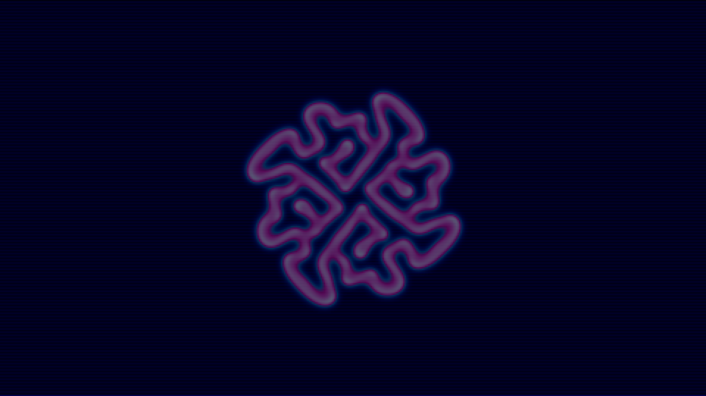

# chiral_turing_morphogenesis

## Metadata
- **Date**: 2026-05-13
- **Theme**: Organic morphogenesis driven by chiral chemical reactions, creating twisting, breathing labyrinths of light.
- **Technique**: Vectorized 2D Gray-Scott Reaction-Diffusion model on a 512x512 grid with a chiral advection term (asymmetric laplacian) and LANCZOS scaling to 4K. Rendered with a Midnight Indigo / Emerald / Amethyst palette. 15s 4K/60fps MP4.
- **Logic Lab Reference**: None

## Concept
A dark, viscous surface erupts with glowing, spiraling green and violet labyrinths that twist and consume each other like a living digital organism.

## Technical Details
- **Renderer**: P2D
- **Simulation**: reaction-diffusion.
- **Visuals**: dark-field contrast.
- **Animation**: 15 seconds at 60fps
