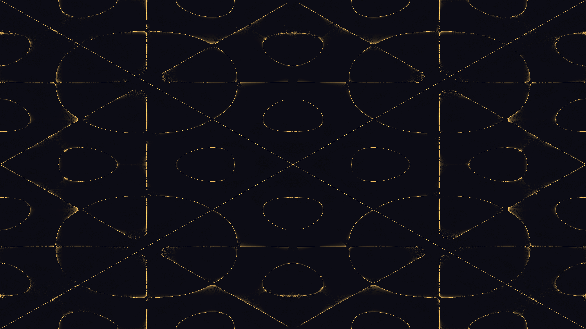

# chladni_acoustic_resonance

Acoustic resonance patterns formed by 500,000 sand particles dancing on a vibrating metal plate.

## Details

- **Date**: 2026-05-31
- **Theme**: Chladni Acoustic Resonance: Sand particles dancing on a vibrating metal plate, forming geometric standing waves as the frequency shifts.
- **Technique**: Millions of particles are placed on a 2D grid and moved using the mathematical gradient of the Chladni plate equation. Points randomly jitter based on the vibration amplitude at their position, causing them to gather precisely on the nodal lines (where vibration is zero). Fully vectorized using Numpy and directly mapped to pixel memory.
- **Palette**: Dark slate metal background with glowing golden sand.

## Previews



## Usage

```bash
uv run python main.py
```
