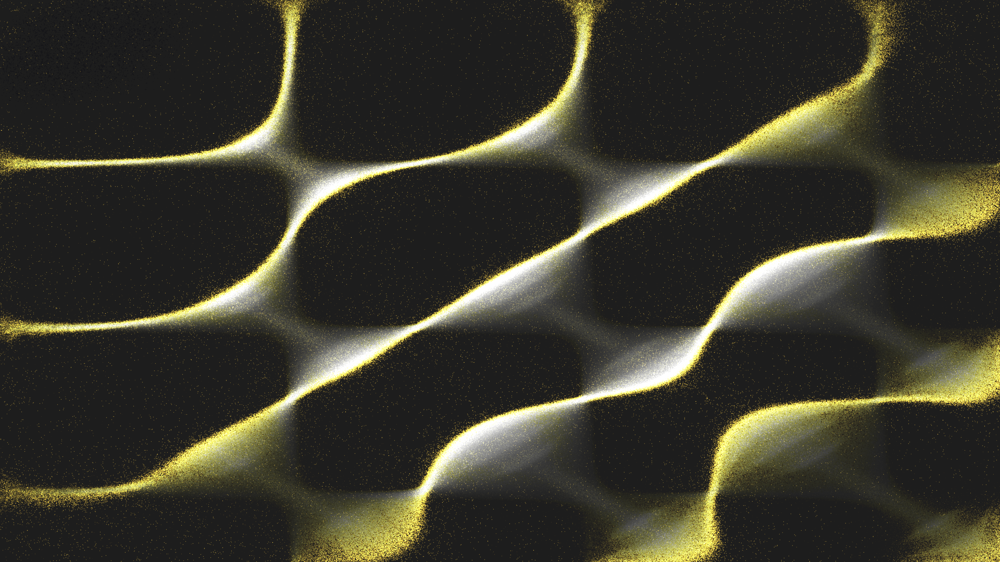

# chladni_plate_resonance

A brass plate vibrating at multiple shifting resonant frequencies, causing golden sand particles to dance and gather along the intricate, shifting nodal lines.

## Technical Details

- **Type**: Animation (15s @ 60fps)
- **Algorithm**: 2D particle simulation (150,000 particles) using the Chladni resonance equation $Z(x,y) = \sin(n \pi x) \sin(m \pi y) + \sin(m \pi x) \sin(n \pi y)$. Particles are advected toward the nodal lines where $Z \approx 0$ by moving along the negative gradient of $|Z|^2$.
- **Rendering**: Multi-pass additive point rendering using `py5.points` with a "Brass / Gold / Amber" HSB palette against a dark slate background to simulate motion blur and accumulation.

## Preview

