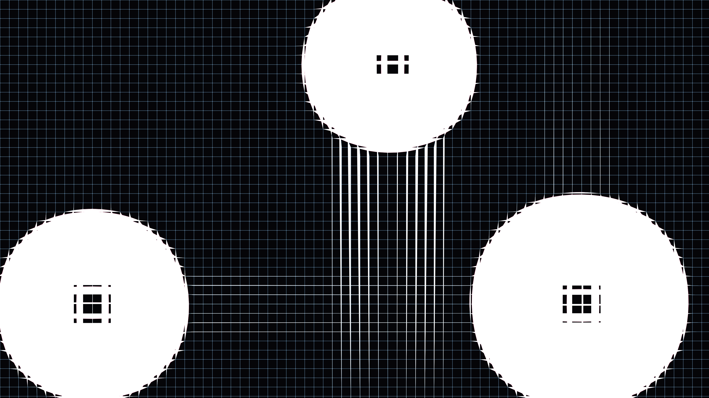

# chromatic_aberration_lens_flare_geometry_2d

An animated 15s sequence of a precise, high-contrast optical illusion featuring overlapping geometric "lenses" that mathematically distort a laser grid underneath, causing intense chromatic aberration.

## Details
- **Format**: Animation (15s @ 60fps)
- **Theme**: A hypnotic, slow-rotating series of overlapping simple geometric shapes that act as optical lenses, distorting and coloring the space behind them.
- **Technique**: 2D drawing of transparent polygons with intense color shifts (chromatic aberration). The background is a grid of fine lines, and as the "lenses" pass over, the lines are mathematically warped using 2D distance fields and drawn in separated RGB channels.
- **Date**: 2026-06-12

## Preview

