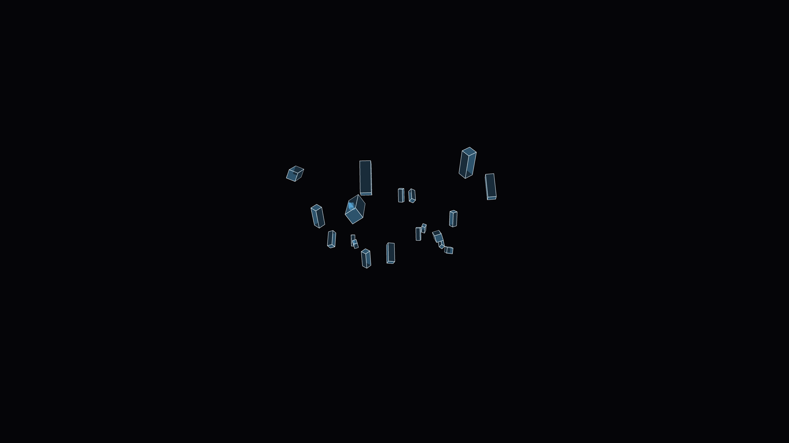

# chromatic_crystal_cavern_3d

## Details
- **Date**: 2026-06-05
- **Format**: Animation (10s @ 60fps)
- **Theme**: A slow cinematic flight through an endless, abstract crystal cavern rendered with multi-layered chromatic dispersion effects.

## Technique
Procedurally generated 3D cave walls using layered Perlin noise meshes. The cavern walls and floating crystals reflect shifting RGB light layers simulating chromatic aberration and refraction, using additive blending for a vibrant, glitchy optical effect.

