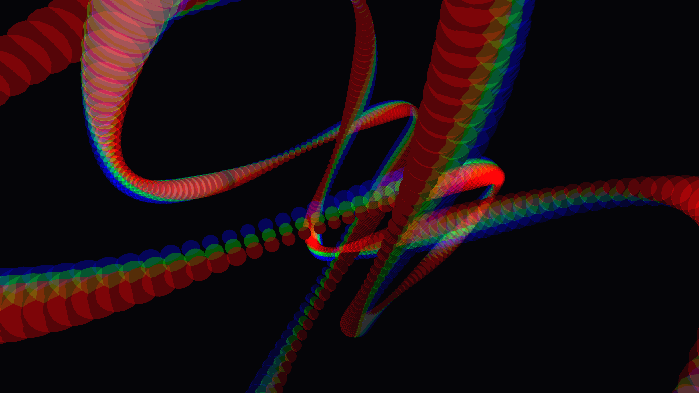

# chromatic_liquid_lissajous_knot_3d

## Details
- **Date**: 2026-06-07
- **Theme**: A hypnotic, continuous loop of thick, glossy liquid metal tying itself into complex Lissajous knots, reflecting a spectrum of intense chromatic light.
- **Technique**: Parametric 3D Lissajous curves drawn with spheres. The radius modulates with sine waves. Additive blending (drawn 3 times for RGB offsets) creates the chromatic liquid metal look.
- **Palette**: Obsidian background, silver/chrome dominant, magenta and cyan secondary (chromatic split).

## Media

