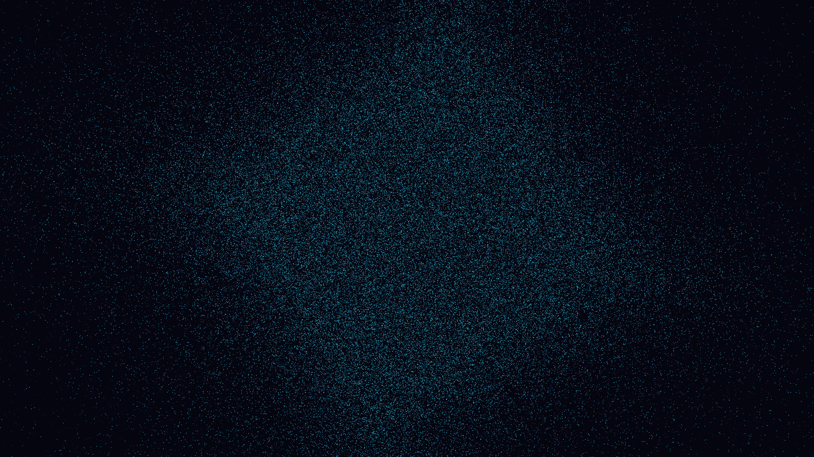

# chromatic_planck_fluctuations

## Metadata
- **Date**: 2026-05-09
- **Theme**: Quantum foam, Planck length, virtual particles, vacuum energy, beautiful night sky.
- **Technique**: 3D simulation of 160,000 "virtual particles" with finite lifetimes (birth/annihilation loop). Particles follow a dynamic 3D noise-based field (interpolated 32^3 volume) representing space-time jitter. Multi-pass additive rendering with lifetime-based alpha modulation and an "Ultraviolet / Electric Cyan / Solar Gold" palette. 60fps high-bitrate MP4.
- **Logic Lab Reference**: None

## Concept
A mesmerizing visualization of the quantum vacuum at the Planck scale; a boiling, iridescent sea of light where spectral sparks of ultraviolet and electric cyan flicker into existence and vanish, revealing the hidden, jittering geometry of space-time against the star-dusted obsidian void.

## Technical Details
- **Renderer**: P3D
- **Simulation**: particle.
- **Visuals**: additive blending, HSB spectral mapping, bloom-like highlights, prismatic color, dark-field contrast.
- **Animation**: 10 seconds at 60fps
