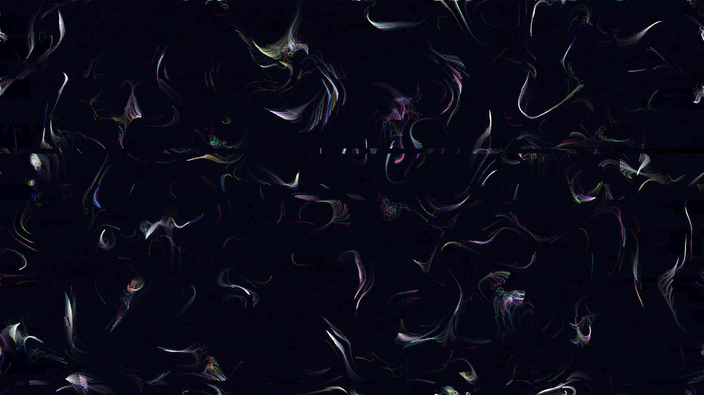

# chromatic_vector_field_glitch

## Metadata
- **Date**: 2026-05-23
- **Theme**: A swirling, dynamic vector field driven by Perlin noise, traversed by thousands of glowing particles, which experiences intense noise spikes that datamosh the buffer.
- **Technique**: Procedural simulation of 10,000 particles moving through an OpenSimplex noise-based vector field. Particles are rendered with time-evolving HSB hues and additive blending. Random noise bursts inject intense localized chaos into the particle trajectories, while NumPy is used to trigger horizontal block datamoshing across the final rendered frame. 15s 60fps MP4.
- **Logic Lab Reference**: None

## Concept
The flow of structured data through an unstable network. Ten thousand data points follow smooth, continuous fluid paths governed by a hidden mathematical manifold, only to be intermittently slammed by catastrophic digital interference that rips the structure apart and forces hard resets of the trajectories.

## Technical Details
- **Renderer**: P2D / default py5
- **Simulation**: 10k particle advection using `py5.os_noise` 3D noise (x, y, t)
- **Visuals**: HSB hue cycling, additive trail fading, NumPy buffer datamoshing
- **Animation**: 15 seconds at 60fps
