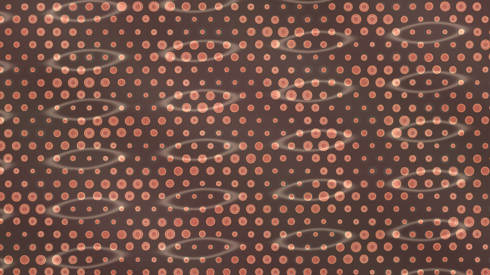

# chromatophore_signal_skin

## Metadata
- **Date**: 2026-05-10
- **Theme**: cephalopod-like skin where chromatophore cells expand and contract under traveling neural signals.
- **Technique**: Procedural staggered cell lattice with vectorized radial pigment masks, ring highlights, iridescent inner bands, and a fading signal-memory buffer. Multi-wave neural activation modulates chromatophore expansion across the skin while pale signal paths drift through warm umber and coral tissue. 10s 4K/60fps MP4, generated as `output.mp4` and mirrored to `chromatophore_signal_skin.mp4`.
- **Logic Lab Reference**: None

## Concept
A living field of coral pigment cells pulses over dark skin while pale nerve-wave ribbons pass through it, making the surface feel like a responsive cephalopod display.

## Technical Details
- **Renderer**: P2D
- **Simulation**: Procedural staggered cell lattice with vectorized radial pigment masks, ring highlights, iridescent inner bands, and a fading signal-memory.
- **Visuals**: dark-field contrast.
- **Animation**: 10 seconds at 60fps
