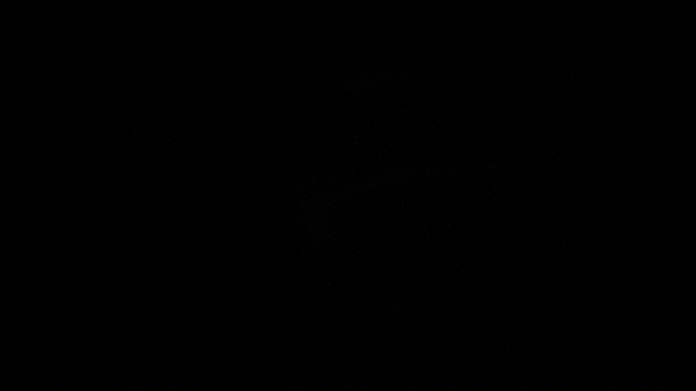

# chromospheric_spicule_flare

## Metadata
- **Date**: 2026-05-08
- **Theme**: Stellar chromosphere, plasma spicules, magnetic reconnection, solar flares, beautiful night sky.
- **Technique**: 3D simulation of a stellar surface featuring hundreds of plasma "spicules" (short-lived vertical jets). 120,000 particles are emitted from a hemispherical base and advected by a dynamic magnetic field composed of 8 rotating dipoles. Periodic "magnetic reconnection" events trigger intense white-gold flares and rapid particle acceleration. Features multi-pass additive rendering with an "Incandescent Amber/Violet" HSB palette and a high-density background starfield (12,000 stars). 60fps high-bitrate MP4.
- **Logic Lab Reference**: None

## Concept
A majestic, high-energy vision of a star's atmosphere; thousands of silken plasma jets erupt from an incandescent amber surface, twisting into complex magnetic loops that snap and flare with ultraviolet light against the star-dusted obsidian void.

## Technical Details
- **Renderer**: P3D
- **Simulation**: particle.
- **Visuals**: additive blending, HSB spectral mapping.
- **Animation**: 15 seconds at 60fps
