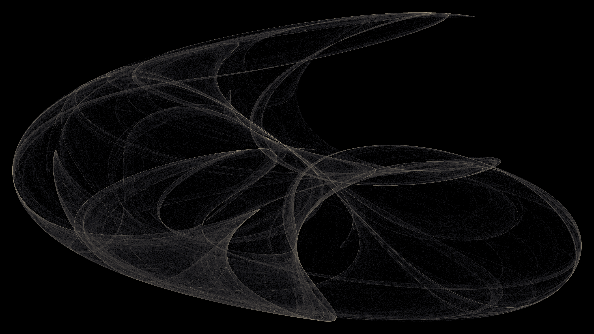

# Clifford Attractor

A strange attractor defined by four trigonometric parameters, revealing chaotic yet structured geometry. Two million trajectory points are accumulated into a density field, log-scaled, and mapped to a dark-to-amber palette — exposing the intricate loops and knotted convergence zones of deterministic chaos.
