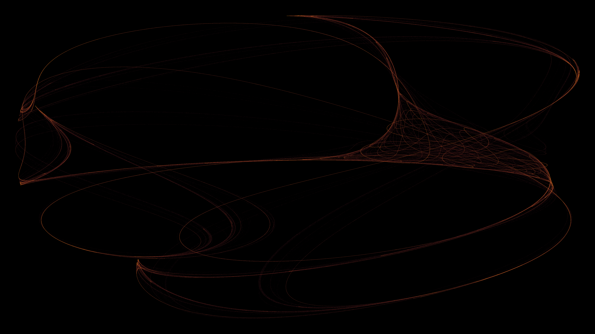

# clifford_attractor

## Metadata
- **Date**: 2026-04-25
- **Theme**: chaos theory, mathematics.
- **Technique**: strange attractor, vectorized multi-trajectory, density accumulation, log-scale mapping.
- **Logic Lab Reference**: None

## Concept
Two million points tracing a Clifford attractor, rendered as a density field with an amber glow on black.

## Technical Details
- **Renderer**: P2D
- **Simulation**: strange attractor, vectorized multi-trajectory, density accumulation, log-scale mapping.
- **Visuals**: bloom-like highlights, dark-field contrast.
- **Animation**: Still image
