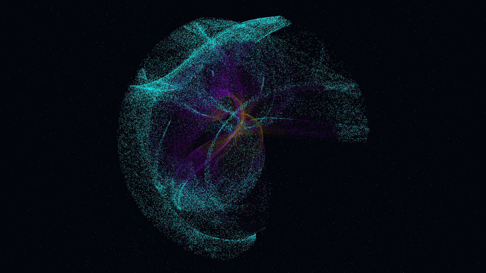

# clifford_vortex_filaments

## Metadata
- **Date**: 2026-05-08
- **Theme**: Chaos theory, non-linear dynamics, attractor manifolds, turbulent flow, beautiful night sky.
- **Technique**: 3D chaotic attractor based on a modified De Jong map. 200,000 particles are iteratively evolved through a system of coupled non-linear equations, where parameters ($a, b, c, d$) are slowly modulated via low-frequency oscillators. Features multi-pass additive point rendering with a "Molten Amber/Neon Violet/Electric Blue" palette and a high-density background starfield. 60fps high-bitrate MP4.
- **Logic Lab Reference**: None

## Concept
A majestic, silken knot of shimmering amber and violet light pulses and shifts in the void, revealing complex filamentary structures that weave through a chaotic mathematical manifold against the star-dusted obsidian night.

## Technical Details
- **Renderer**: P3D
- **Simulation**: particle.
- **Visuals**: additive blending, bloom-like highlights, dark-field contrast.
- **Animation**: 20 seconds at 60fps
