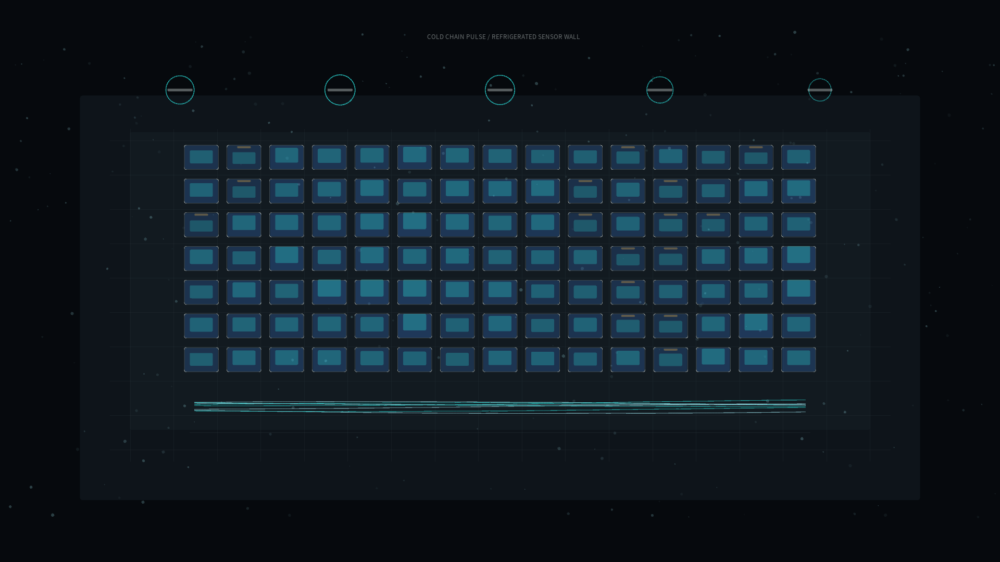

# cold_chain_pulse

## Metadata
- **Date**: 2026-05-19
- **Theme**: A refrigerated storage wall breathing through compressor cycles as cold air and humidity drift through each bay.
- **Technique**: Procedural cold-chain sensor grid with bay temperatures, humidity rings, compressor pulses, condensation particles, and scrolling thermal traces.
- **Logic Lab Reference**: None

## Concept
`cold_chain_pulse` treats refrigerated logistics as a quiet atmospheric system. Storage bays glow according to temperature, mist drifts across the wall, compressor rings pulse above the rack, and thin sensor traces reveal cold moving through the system.

## Technical Details
- **Renderer**: P2D
- **Simulation**: Multi-bay temperature and humidity relaxation with compressor phase forcing, condensation particles, and scrolling traces
- **Visuals**: Dark insulated panel, blue-cyan cold fields, ice mist, amber warning ticks, silver sensor grid
- **Animation**: 10 seconds at 60fps, generating `output.mp4` and `cold_chain_pulse_p1.png`
