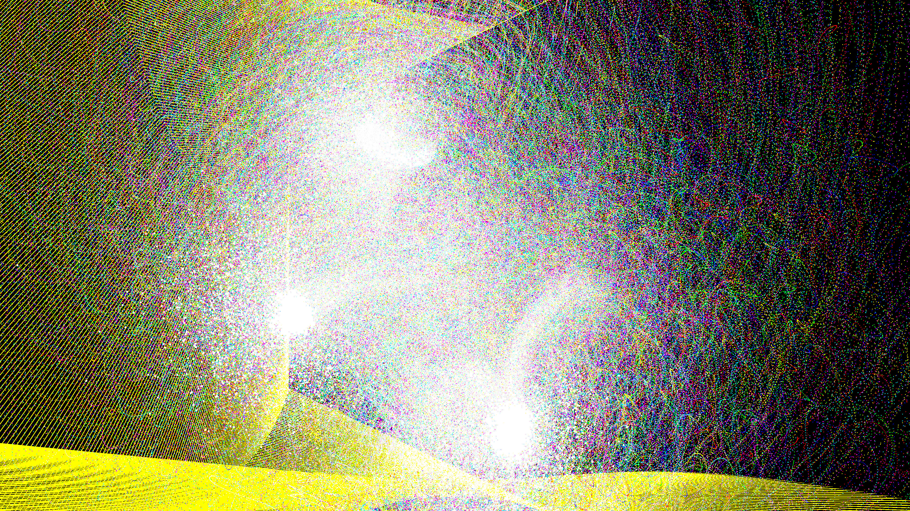

# color_flux_string_breaking

## Metadata
- **Date**: 2026-05-10
- **Theme**: Quantum Chromodynamics (QCD), string breaking, quark confinement, beautiful night sky.
- **Technique**: 3D particle simulation of strong force confinement. 30,000 quarks (particles) connected by "color flux tubes". As they drift apart due to high-energy scattering, the tension increases until it "snaps", spawning new quark-antiquark pairs. Rendered with additive blending, using RGB (Red, Green, Blue) and their anti-colors as the literal "color charge".
- **Logic Lab Reference**: None

## Concept
A dense, chaotic web of intense RGB threads that constantly stretch and snap with blinding white flashes, weaving an ever-expanding, intricate quantum tapestry that illustrates the inescapable confinement of quarks.

## Technical Details
- **Renderer**: P3D
- **Simulation**: particle, 3D particle.
- **Visuals**: additive blending, dark-field contrast.
- **Animation**: 12 seconds at 60fps
