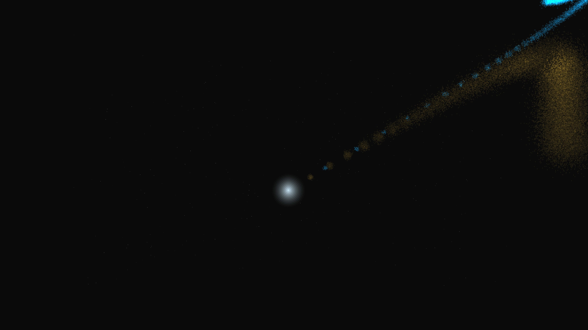

# cometary_ion_tail

## Metadata
- **Date**: 2026-05-05
- **Theme**: Comet, ion tail, dust tail, solar wind, beautiful night sky.
- **Technique**: 3D particle simulation (60,000 particles) with a dual-tail physics model. Implements a curved, golden "dust tail" (inertia + radiation pressure) and a straight, electric-blue "ion tail" (noise-driven solar wind advection). Multi-layer rendering for the cometary coma and shimmering tail filaments. 60fps high-bitrate MP4 encoding.
- **Logic Lab Reference**: None

## Concept
A magnificent comet streaking through the deep celestial void; its nucleus glows with a ghostly white light, trailing a massive dual tail that stretches across the stars—one curving gracefully like a golden ribbon, the other pointing rigidly away from the sun in a beam of shimmering electric blue.

## Technical Details
- **Renderer**: P3D
- **Simulation**: particle, 3D particle.
- **Visuals**: dark-field contrast.
- **Animation**: 10 seconds at 60fps
