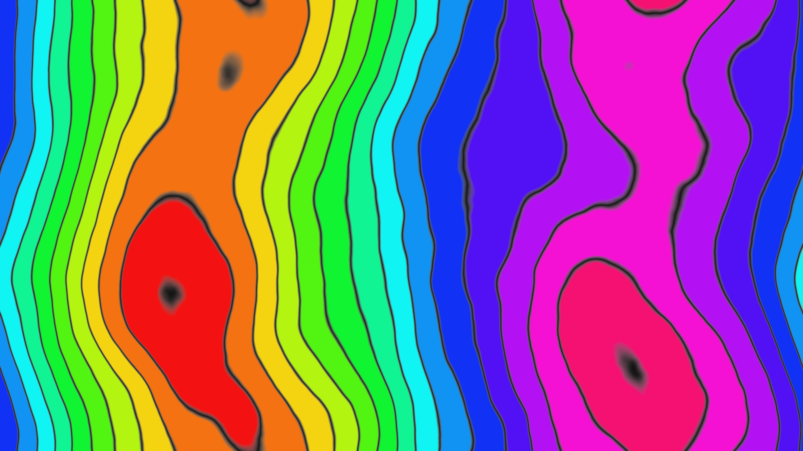

# Contour Field

A fractal terrain field is synthesized via inverse FFT with a 1/f² power spectrum, producing smooth organic hills unique to every run. The elevation is rendered as 14 topographic contour bands with sharp dark boundaries, each band cycling through the full color spectrum. The result reads simultaneously as abstract cartography and pure color field composition.
