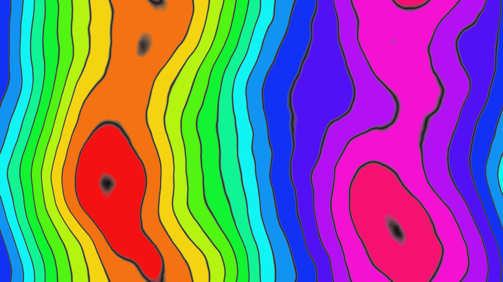

# contour_field

## Metadata
- **Date**: 2026-04-25
- **Theme**: abstract cartography, landscape, topology.
- **Technique**: 2D FFT spectral terrain synthesis (1/f² power spectrum), topographic contour band coloring.
- **Logic Lab Reference**: None

## Concept
Fractal terrain field via inverse FFT rendered as 14 colorful topographic contour bands with sharp dark borders; organic hills unique to every run.

## Technical Details
- **Renderer**: P2D
- **Simulation**: FFT.
- **Visuals**: HSB spectral mapping, prismatic color, dark-field contrast.
- **Animation**: 8 seconds at 30fps
