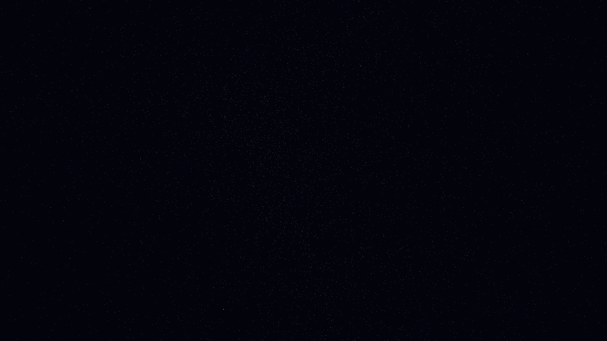

# cosmic_filament_condensation

## Metadata
- **Date**: 2026-05-09
- **Theme**: Large-scale structure, baryon acoustic oscillations, cosmic web, dark matter halos, beautiful night sky.
- **Technique**: 3D simulation of 150,000 particles representing baryonic matter and dark matter tracers. Implements a multi-scale gravitational clustering algorithm towards 12 dynamic "dark matter hubs" using a modified $1/r^{1.2}$ potential. Features global harmonic oscillations (BAO) and multi-pass additive rendering with a "Crystalline White / Deep Cobalt / Ionized Magenta" palette. 60fps high-bitrate MP4.
- **Logic Lab Reference**: None

## Concept
A majestic visualization of the formation of the Cosmic Web; silken filaments of ionized magenta and deep cobalt light stretch across the void, condensing into brilliant crystalline white clusters driven by the rhythmic pulse of primordial sound waves against the star-dusted night.

## Technical Details
- **Renderer**: P3D
- **Simulation**: particle.
- **Visuals**: additive blending, dark-field contrast.
- **Animation**: 10 seconds at 60fps
