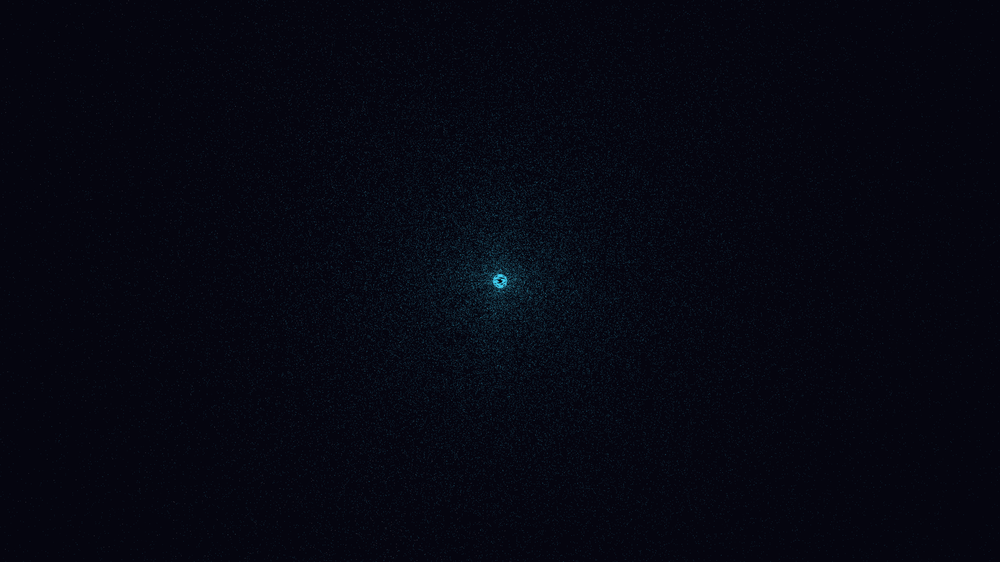

# cosmic_inflation_pulse

## Metadata
- **Date**: 2026-05-07
- **Theme**: Big Bang, cosmic inflation, exponential expansion, cooling of the universe, large-scale structure seeding, beautiful night sky.
- **Technique**: 3D particle simulation (250,000 particles) using an exponential expansion model. Particles are emitted from a central singularity and rapidly pushed outward. Implements "quantum seeding" where multi-harmonic interference in the early phase grows into silken filaments and clusters. Features a time-dependent temperature mapping from blinding white to electric cyan and royal amethyst. 60fps high-bitrate MP4.
- **Logic Lab Reference**: None

## Concept
A breathtaking visualization of the birth of the cosmos; a blindingly bright point of light erupts into a vast, shimmering web of spectral energy that cools and self-organizes into intricate filaments against the deep, expanding indigo void.

## Technical Details
- **Renderer**: P3D
- **Simulation**: particle, 3D particle.
- **Visuals**: HSB spectral mapping, bloom-like highlights, prismatic color, dark-field contrast.
- **Animation**: 10 seconds at 60fps
