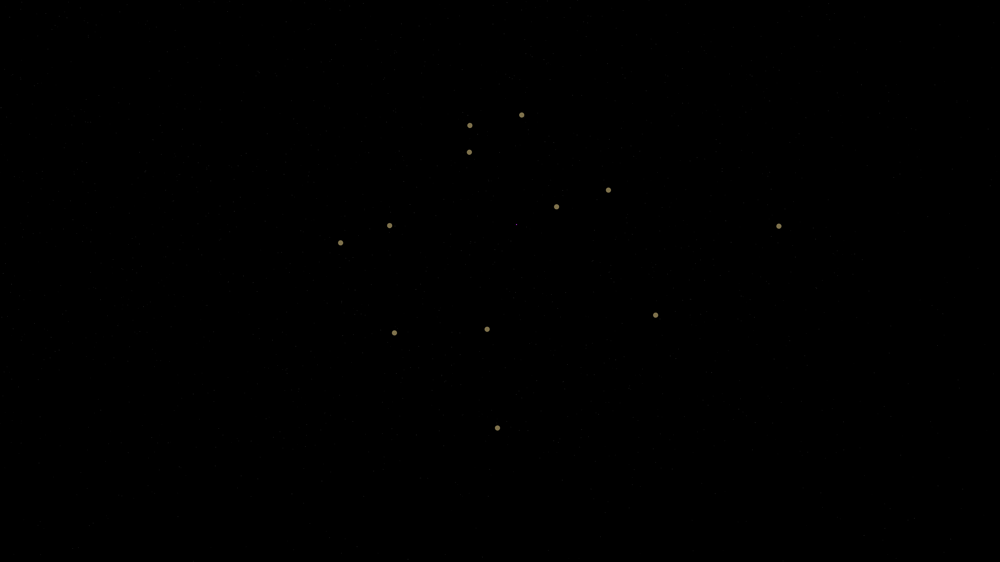

# cosmic_loom

## Metadata
- **Date**: 2026-05-06
- **Theme**: Cosmic weaving, spacetime fabric, silken threads, beautiful night sky.
- **Technique**: 3D particle simulation (100,000 particles) using a "weaving" attractor model. Three dynamic 3D Bezier splines ("loom stars") move in complex, harmonic paths through the void. Particles are attracted to the nearest points on the splines, creating dense, shimmering filaments that trace the weaving motion. Multi-pass rendering with high-persistence trails and additive blending. 60fps high-bitrate MP4 encoding.
- **Logic Lab Reference**: None

## Concept
An intricate, shimmering tapestry of light that appears to be woven by invisible celestial needles; silken threads of royal amethyst and electric indigo energy curve and twist across the star-dusted void, leaving glowing white-gold echoes of their harmonic dance.

## Technical Details
- **Renderer**: P3D
- **Simulation**: particle, 3D particle.
- **Visuals**: additive blending, HSB spectral mapping, persistent trails, bloom-like highlights, prismatic color, dark-field contrast.
- **Animation**: 10 seconds at 60fps
