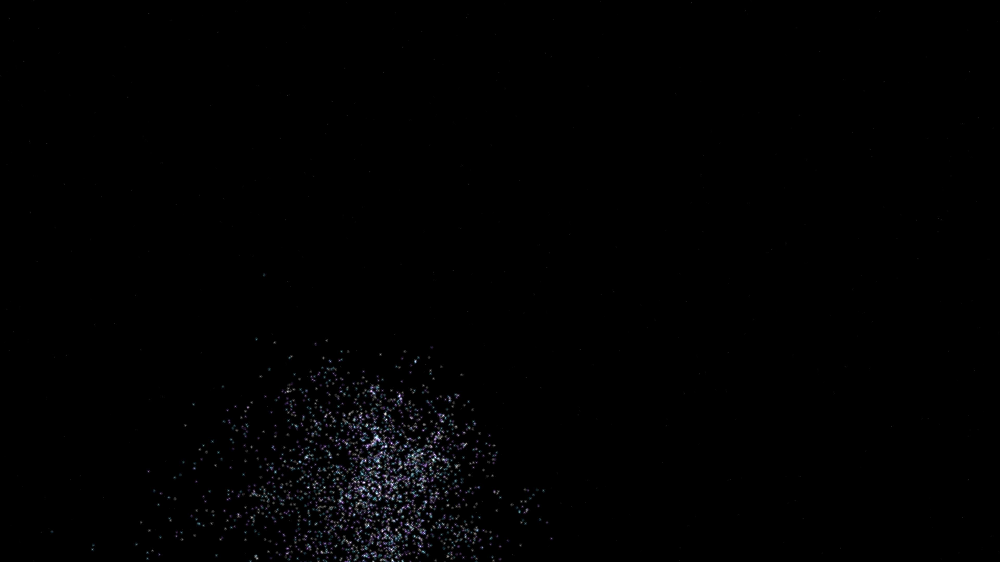

# cosmic_ray_cascade_resonance

## Metadata
- **Date**: 2026-05-11
- **Theme**: High-energy astrophysics, cosmic ray air showers, particle physics, beautiful night sky.
- **Technique**: 3D particle cascade simulation (Heitler model). A primary high-energy particle triggers a stochastic branching process, spawning secondaries (pions, muons, electrons) in a narrow relativistic cone. Features 50,000 spectral particles at the shower peak. Rendered with manual 3D-to-2D projection, multi-pass additive blending, and a "Blinding White / Electric Cyan / Deep Amethyst" palette. 10s 4K/60fps MP4.
- **Logic Lab Reference**: None

## Concept
A majestic eruption of light; a single streak from the top of the frame shatters into a vast, shimmering cone of spectral particles that illuminate the obsidian void like a fleeting ghost.

## Technical Details
- **Renderer**: P2D
- **Simulation**: particle, 3D particle.
- **Visuals**: additive blending, HSB spectral mapping, bloom-like highlights, prismatic color, dark-field contrast.
- **Animation**: 10 seconds at 60fps
