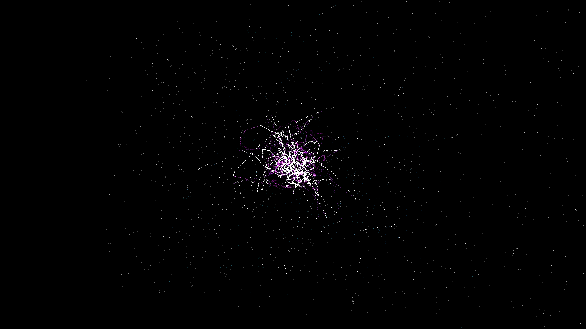

# cosmic_string_network

## Metadata
- **Date**: 2026-05-07
- **Theme**: Topological defects, cosmic strings, loops, primordial universe, beautiful night sky.
- **Technique**: 3D simulation of a cosmic string network featuring 12 infinite strings and 40 closed loops. 120,000 particles are sampled along the paths using vectorized linear interpolation and animated with harmonic noise. Features intensity peaks at "cusps" where strings reach high energy, rendered with blinding white highlights. Multi-pass additive rendering uses an "Ultraviolet Singularity" palette (Cyan/Amethyst/Indigo) and a high-density starfield (10,000 stars). 60fps high-bitrate MP4.
- **Logic Lab Reference**: None

## Concept
A vast, shimmering web of razor-sharp light threads that twist and snap in the primordial void; silken loops of electric cyan and white energy drift and dissolve against a deep, star-dusted night sky, representing the energy relics of the early universe.

## Technical Details
- **Renderer**: P3D
- **Simulation**: particle.
- **Visuals**: additive blending, HSB spectral mapping, bloom-like highlights, prismatic color, dark-field contrast.
- **Animation**: 10 seconds at 60fps
