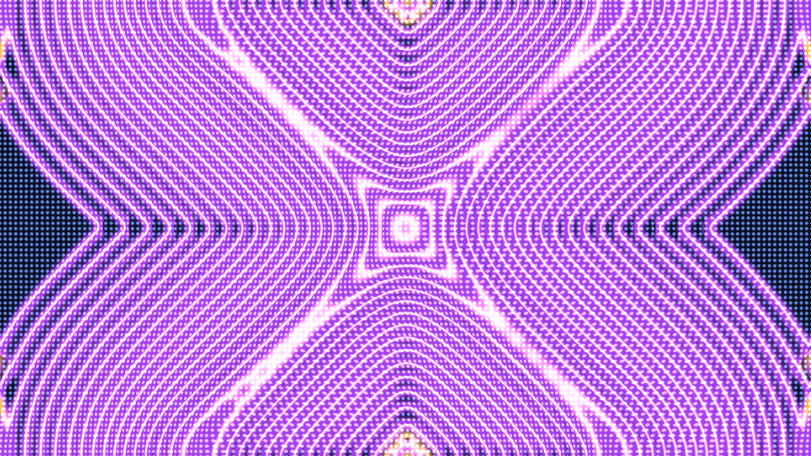

# crystal_dislocation_glide

## Metadata
- **Date**: 2026-05-22
- **Theme**: The sudden, violent slipping of microscopic lattice defects through an atomic crystal under immense 
- **Technique**: Unknown
- **Logic Lab Reference**: 

## Concept
The sudden, violent slipping of microscopic lattice defects through an atomic crystal under immense pressure, visualizing the invisible physics of plastic deformation.

## Technical Details
- **Renderer**: Unknown
- **Simulation**: Unknown
- **Visuals**: Unknown
- **Animation**: Contains animation details
