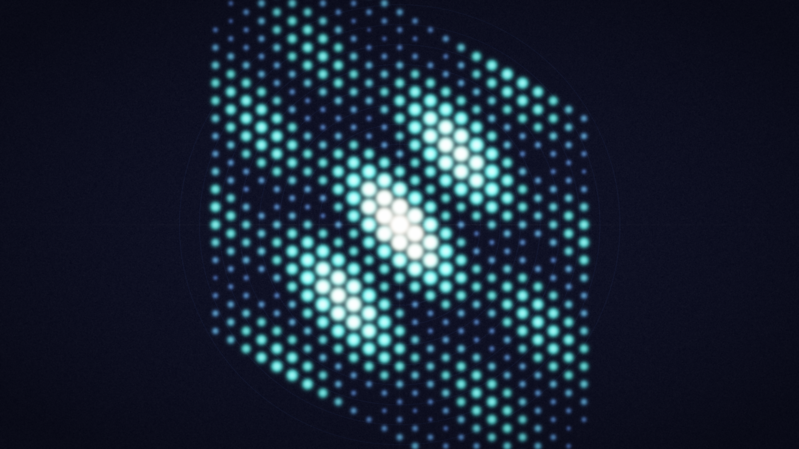

# crystal_lattice

## Metadata
- **Date**: 2026-04-26
- **Theme**: crystallography, physics, X-ray diffraction, hidden order, symmetry.
- **Technique**: reciprocal lattice Fourier transform, structure factor with multi-atom basis, Debye-Waller damping, Gaussian spot rendering, Laue zone rings.
- **Logic Lab Reference**: None

## Concept
X-ray diffraction pattern from a randomly chosen 2D crystal lattice (hexagonal/square/rectangular/oblique); reciprocal lattice spots glow cyan-to-gold with intensity from structure-factor phase summation; systematic extinctions reveal multi-atom basis symmetry against deep midnight with concentric Laue rings.

## Technical Details
- **Renderer**: P2D
- **Simulation**: reciprocal lattice Fourier transform, structure factor with multi-atom basis, Debye-Waller damping, Gaussian spot rendering, Laue zone rings.
- **Visuals**: dark-field contrast.
- **Animation**: Still image
