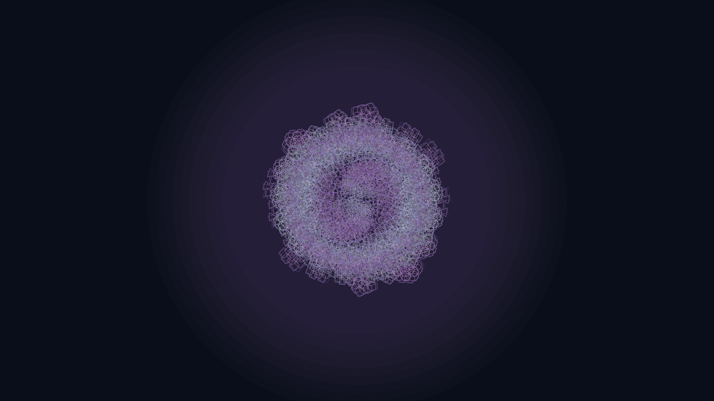

# crystalline_bloom

## Metadata
- **Date**: 2026-05-04
- **Theme**: Geometric efflorescence, frozen growth, mineral intelligence.
- **Technique**: Fermat spiral (phyllotaxis), recursive polygon subdivision, depth-weighted spectral coloring, animated breathing scaling.
- **Logic Lab Reference**: None

## Concept
A complex, multi-layered "mineral bloom" that pulses with cold light; thousands of recursive geometric petals are arranged in a perfect Fermat spiral, shifting between shimmering silver and deep amethyst as the structure breathes and rotates.

## Technical Details
- **Renderer**: P3D
- **Simulation**: recursive.
- **Visuals**: HSB spectral mapping, prismatic color, dark-field contrast.
- **Animation**: 12 seconds at 60fps
