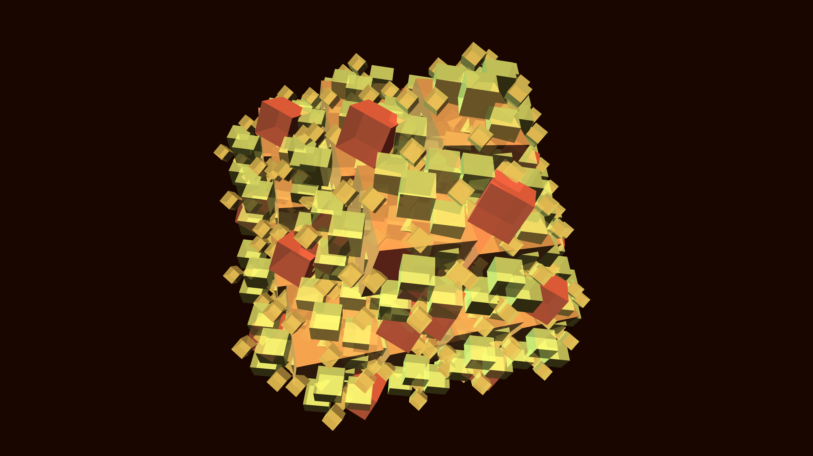

# crystalline_cyber_bloom

## Metadata
- **Date**: 2026-05-31
- **Theme**: A crystalline cyber-bloom rotating in a void
- **Technique**: Unknown
- **Logic Lab Reference**: 

## Concept
A crystalline cyber-bloom rotating in a void. Geometric forms unfold and scale infinitely inside each other like a high-tech mandelbrot.

## Technical Details
- **Renderer**: P3D
- **Simulation**: Unknown
- **Visuals**: Unknown
- **Animation**: Unknown
