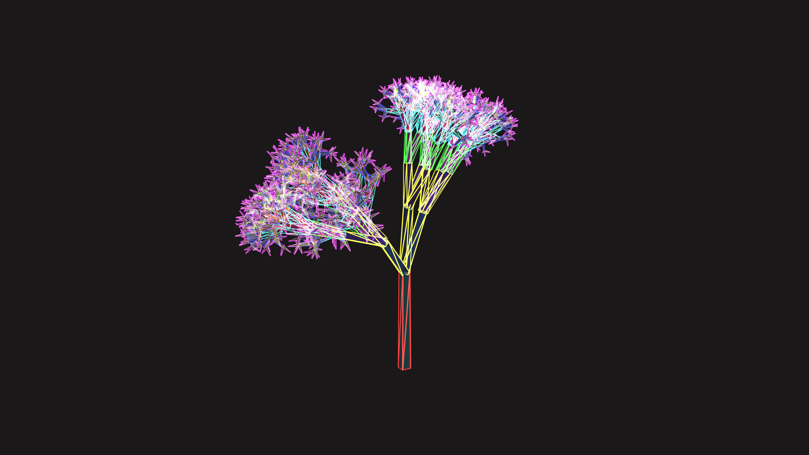

# crystalline_fractal_tree_refraction_3d

## Metadata
- **Date**: 2026-06-13
- **Theme**: A sprawling, crystalline algorithmic tree that grows dynamically in 3D space, heavily refracting lig
- **Technique**: 3D recursive branching function using `py5.push_matrix()` and `py5.pop_matrix()`. The angles of rotation are driven by time to make the branches continuously fold and unfold. Triangles are drawn using `TRIANGLE_STRIP` with additive blending and stroke colors that shift based on depth to simulate refraction.
- **Logic Lab Reference**: 

## Concept
A sprawling, crystalline algorithmic tree that grows dynamically in 3D space, heavily refracting light like a complex prism. Its branches continuously split and rotate, simulating a 3D L-System but constructed from translucent, glowing geometric shards.

## Technical Details
- **Renderer**: Unknown
- **Simulation**: Unknown
- **Visuals**: Unknown
- **Animation**: Animation (20s @ 60fps)
