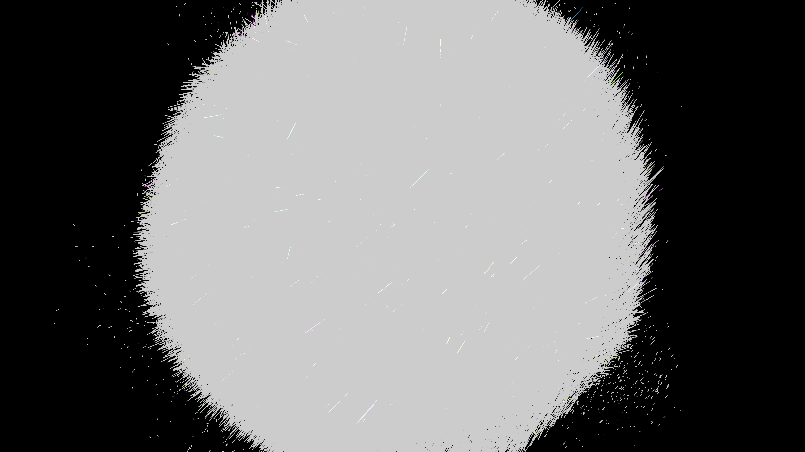

# curl_noise_particle_flow_3d

## Metadata
- **Date**: 2026-05-27
- **Theme**: - **Date**: 2026-05-27 - **Theme**: A dense swarm of glowing particles flowing through a 3D curl noi
- **Technique**: Unknown
- **Logic Lab Reference**: 

## Concept
- **Date**: 2026-05-27
- **Theme**: A dense swarm of glowing particles flowing through a 3D curl noise vector field. The trails twist and curl back on themselves, creating organic, fluid-like wisps.
- **Technique**: Particles have position and velocity, updated continuously by reading a 3D Perlin noise field and computing the curl (the cross product of the gradient). Particles leave glowing trails using additive blending.
- **Description**: An animated 3D curl noise particle flow.

## Technical Details
- **Renderer**: Unknown
- **Simulation**: Unknown
- **Visuals**: Unknown
- **Animation**: Unknown
