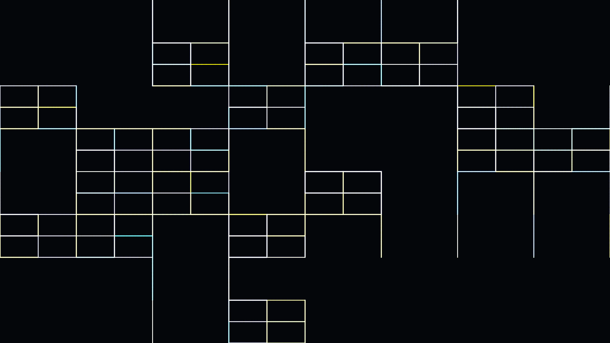

# cyber_circuits

A generative visualization of a pulsating digital metropolis, where data flows through a hierarchical network of glowing circuits.

## Concept

This artwork explores the aesthetic of "Digital Archeology" and cybernetic systems. By combining recursive grid subdivision with constrained random walks, it creates a visual representation of a complex processing unit or a futuristic city seen from above. The work captures the contrast between the rigid, mathematical structure of the machine and the fluid, organic flow of information (the "data packets") that brings it to life.

## Technique

- **Multi-Scale Grid Subdivision**: A recursive algorithm creates a hierarchical grid with varying densities, ensuring a strong visual composition and hierarchy.
- **Manhattan Pathfinding**: Constrained random walks follow the grid lines at 90-degree angles to maintain a technical, circuit-like aesthetic.
- **Agent-Based Packets**: Autonomous "data packet" particles with their own trails and varied dynamics navigate the network.
- **Additive Blending**: Glowing lines and junctions are rendered using additive blending (`py5.ADD`) to simulate bioluminescent or electrical energy.
- **Hierarchical Growth**: The network builds itself over time, starting from core trunks and branching into finer, denser peripheral circuits.

## Data

- **Date**: 2026-05-02
- **Theme**: Urban & Machine, Cybernetics, Digital Metaphor
- **Technique**: Recursive grid subdivision, Manhattan random walk, Particle trails
- **Format**: 8s Animation @ 60fps (MP4)
