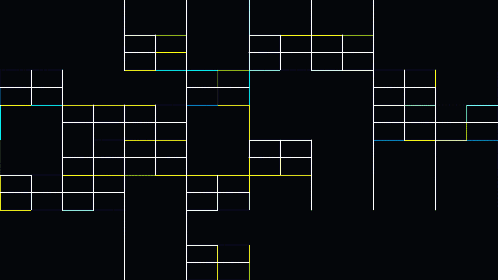

# cyber_circuits

## Metadata
- **Date**: 2026-05-02
- **Theme**: urban, machine, cybernetics, digital metaphor.
- **Technique**: recursive grid subdivision, Manhattan random walk, particle trails, additive blending.
- **Logic Lab Reference**: None

## Concept
A pulsating digital metropolis where data packets navigate a hierarchical network of glowing circuits in cyber lime, electric blue, and hot pink.

## Technical Details
- **Renderer**: P2D
- **Simulation**: particle, recursive.
- **Visuals**: additive blending, persistent trails, dark-field contrast.
- **Animation**: 8 seconds at 60fps
