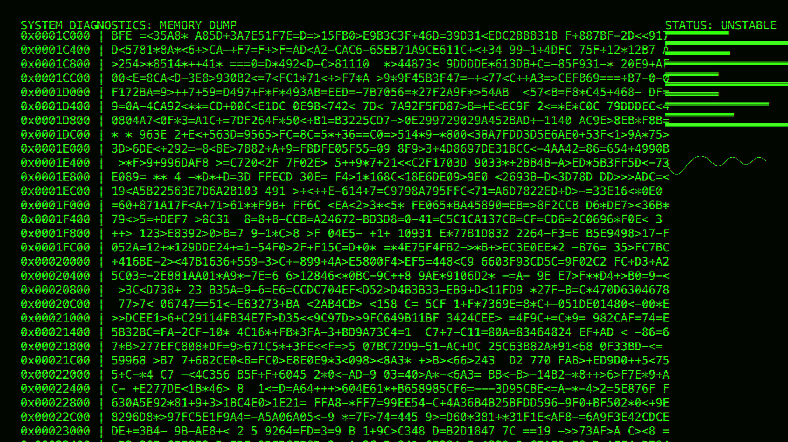

# cyber_glitch_crt_typography_2d

## Metadata
- **Date**: 2026-06-09
- **Theme**: An intense, real-time 2D typographic simulation of a critically failing military CRT monitor
- **Technique**: Unknown
- **Logic Lab Reference**: 

## Concept
An intense, real-time 2D typographic simulation of a critically failing military CRT monitor. As dense streams of hexadecimal machine code and diagnostic layouts scroll up the screen, the video output suffers from severe analog degradation, including deep horizontal tracking tears, pronounced RGB channel separation (chromatic aberration), moving scanlines, and violent vertical sync rolls. The post-processing effects are driven purely by NumPy array manipulation in py5.

## Technical Details
- **Renderer**: P2D
- **Simulation**: Unknown
- **Visuals**: Unknown
- **Animation**: Contains animation details
