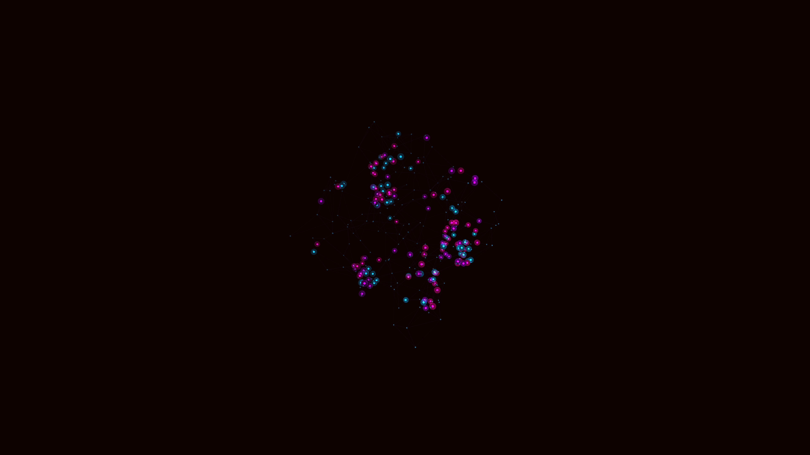

# cyber_neural_synapse_matrix_3d

## Details
- **Date**: 2026-06-07
- **Theme**: A glowing 3D matrix of cybernetic neural synapses, pulsing with neon data streams.
- **Technique**: Procedurally generated network of nodes and connections (lines), with flowing particles moving along the connections using additive blending.
- **Palette**: Obsidian background, electric blue, neon pink, and vibrant purple dominant.

## Media

