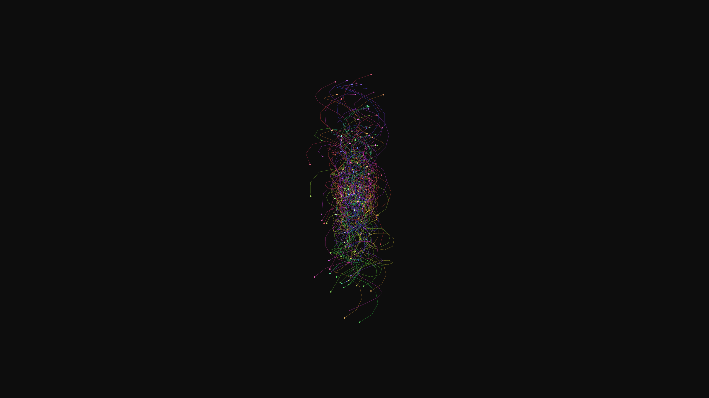

# cyber_optical_fiber_bloom_3d

## Metadata
- **Date**: 2026-06-13
- **Theme**: An intricate, 3D fractal-like tree structure made of glowing optical fibers that grows and branches 
- **Technique**: Procedurally generated using parametric lines and golden ratio distribution, with dynamic 3D noise adding a rotational wind effect. Additive blending with a dynamic hue cycle.
- **Logic Lab Reference**: 

## Concept
An intricate, 3D fractal-like tree structure made of glowing optical fibers that grows and branches recursively, swaying gently in an invisible wind.

## Technical Details
- **Renderer**: Unknown
- **Simulation**: Unknown
- **Visuals**: Unknown
- **Animation**: Animation (15s @ 60fps)
