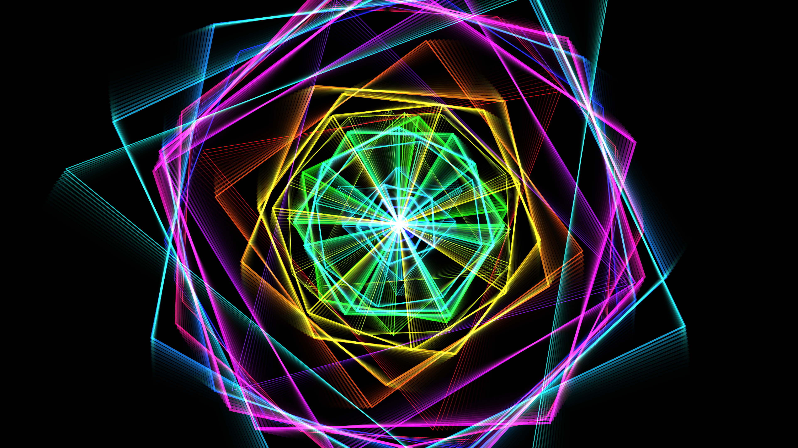

# cyber_optical_illusion_mandala_2d

## Metadata
- **Date**: 2026-06-17
- **Theme**: A 2D animation of a highly complex geometric mandala that rotates and pulses, creating a strong opti
- **Technique**: Uses nested `py5.push_matrix` and `py5.rotate` to draw layered concentric geometric polygons that rotate in alternating directions. The line thickness and scale are modulated by sine waves based on time, creating a hypnotic breathing effect. Connective inner lines add to the intricate density.
- **Logic Lab Reference**: 

## Concept
A 2D animation of a highly complex geometric mandala that rotates and pulses, creating a strong optical illusion of depth and movement, using high-contrast neon colors on a black background.

## Technical Details
- **Renderer**: Unknown
- **Simulation**: Unknown
- **Visuals**: Unknown
- **Animation**: Unknown
