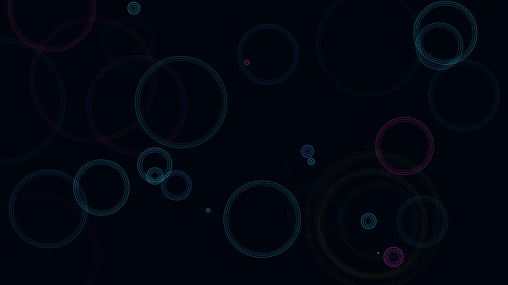

# cyber_rain_caustics

## Metadata
- **Date**: 2026-05-27
- **Theme**: - **Date**: 2026-05-27 - **Theme**: A stylized top-down view of glowing, neon-colored rain hitting a
- **Technique**: Unknown
- **Logic Lab Reference**: 

## Concept
- **Date**: 2026-05-27
- **Theme**: A stylized top-down view of glowing, neon-colored rain hitting a dark metallic surface. When a raindrop hits, it creates expanding ripples that intersect and blend additively, creating chaotic caustics.
- **Technique**: A 2D particle system. Ripples expand over time and fade out. Rendered with additive blending and multiple rings per ripple to create intense intersections.
- **Description**: An animated 2D cyber rain caustics simulation.

## Technical Details
- **Renderer**: Unknown
- **Simulation**: Unknown
- **Visuals**: Unknown
- **Animation**: Unknown
