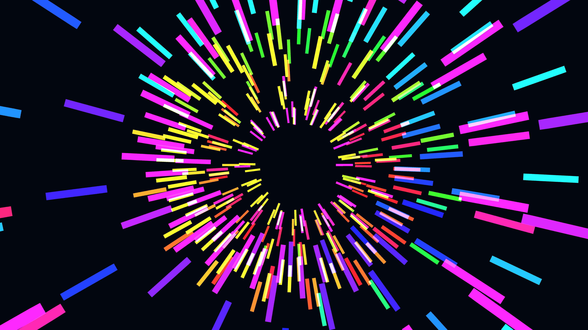

# cyber_wormhole_hyper_tunnel_3d

A hyper-speed tunnel effect using warped 3D geometric rings that give the illusion of traveling through a glowing cyber-wormhole.

## Technique

An array of 3D rings arranged along the Z-axis, with their Z-positions continuously wrapping to simulate forward movement. The rings are distorted via 4D OpenSimplex noise and drawn as stretched 3D boxes. Additive blending combined with a dynamically shifting color palette gives the illusion of a high-speed cybernetic wormhole.
