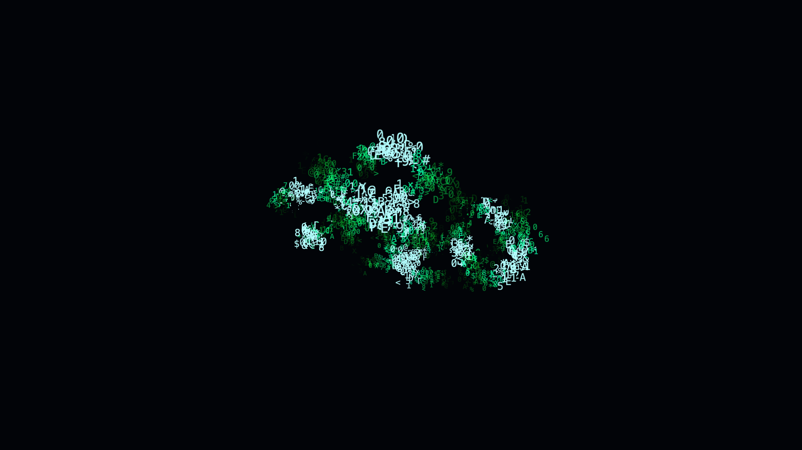

# cybernetic_ascii_matrix_hologram_3d

An animated 15s sequence of a 3D hologram of a rotating cybernetic torus knot built entirely out of floating, glowing ASCII characters that stream and shift.

## Details
- **Format**: Animation (15s @ 60fps)
- **Theme**: A 3D hologram of a rotating cybernetic torus knot built entirely out of floating, glowing ASCII characters that stream and shift.
- **Technique**: Generates a 3D point cloud of a torus knot, drawing a random text character at each point. The text characters use "billboarding" (always facing the camera) while the entire structure rotates. Additive blending and neon green/cyan colors mimic a classic matrix-style hologram, with bright pulses traveling along the knot's geometry.
- **Date**: 2026-06-12

## Preview

