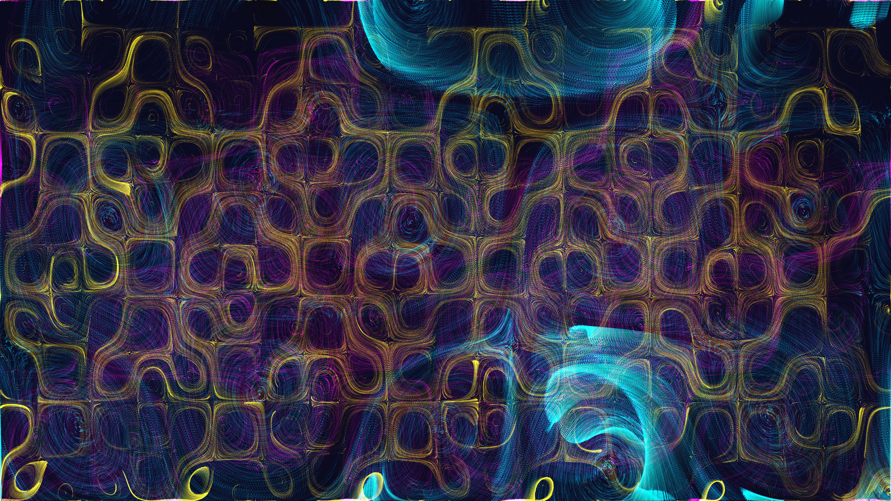

# cybernetic_curl_noise_particle_flow_2d

## Details
- **Date**: 2026-06-10
- **Theme**: 150,000 glowing neon particles swept through a turbulent mathematical curl noise field, leaving long fading trails that weave together to form a cybernetic, geometric lattice structure.
- **Technique**: Vectorized 2D NumPy particle simulation evaluating the analytical derivative of a complex sine-based noise function to generate divergence-free curl. Particles are split into Cyan, Magenta, and Yellow groups with different speeds, using `py5.blend_mode(py5.ADD)` and a fading background to create luminous trails.

## Media

