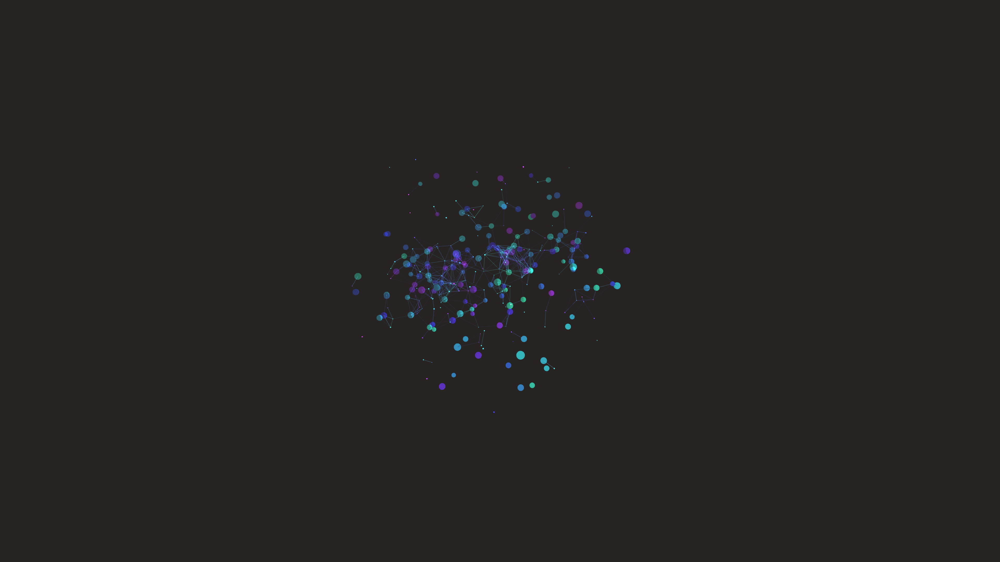

# cybernetic_data_constellation_web_3d

## Metadata
- **Date**: 2026-06-20
- **Theme**: A 3D web of glowing data nodes connected by shimmering energetic links, representing a complex neura
- **Technique**: Procedural generation of a 3D network graph where nodes slowly drift using Perlin noise. Connections fade in and out based on proximity and time-based pulsing. Rendered with additive blending, glowing spheres, and cyan/purple palettes.
- **Logic Lab Reference**: 

## Concept
A 3D web of glowing data nodes connected by shimmering energetic links, representing a complex neural or data constellation.

## Technical Details
- **Renderer**: Unknown
- **Simulation**: Unknown
- **Visuals**: Unknown
- **Animation**: Contains animation details
