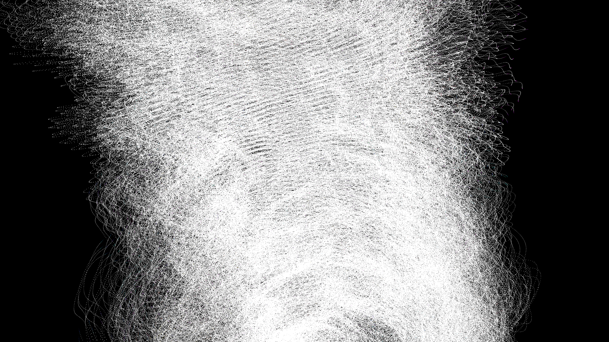

# cybernetic_data_fabric_flow_3d

A high-density flow of information forming a 3D cybernetic fabric that ripples like silk.

## Details
- **Date**: 2026-06-20
- **Technique**: A 3D particle system using `py5.points` and `py5.lines` tracing a continuous flow field over a parametric cylinder. Additive blending and neon hues simulate data transfer.
- **Format**: Animation (12s @ 60fps)
