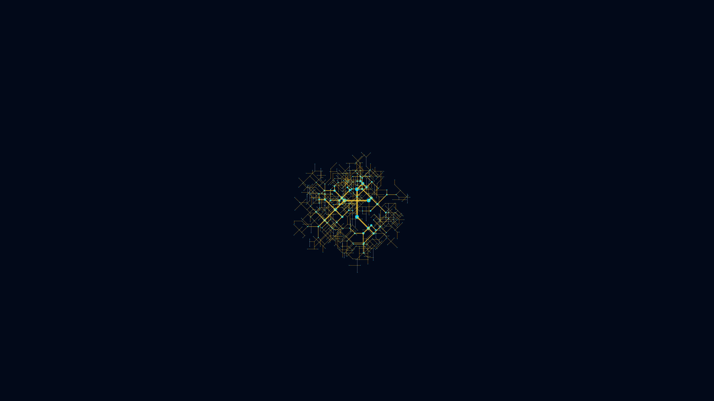

# cybernetic_fractal_circuit_board_2d

## Metadata
- **Date**: 2026-06-16
- **Theme**: An infinitely zooming, self-generating cybernetic circuit board with golden pathways branching at 90
- **Technique**: Unknown
- **Logic Lab Reference**: 

## Concept
An infinitely zooming, self-generating cybernetic circuit board with golden pathways branching at 90 and 45 degree angles, pulsing with data packets.

## Technical Details
- **Renderer**: Unknown
- **Simulation**: Unknown
- **Visuals**: Unknown
- **Animation**: Contains animation details
