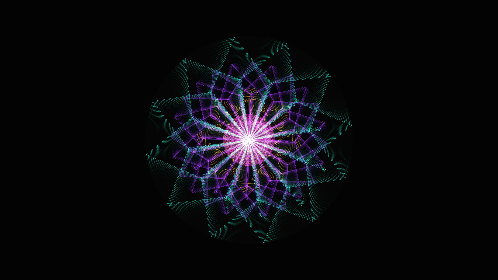

# cybernetic_geometric_mandala_2d

A hypnotic, self-assembling 2D geometric mandala built from pulsing cybernetic lines and polygons.

## Details
- **Date**: 2026-06-20
- **Technique**: Layered 2D rotation grids and sine-wave driven scaling parameters. Neon outlines with additive blending.
- **Format**: Animation (10s @ 60fps)
