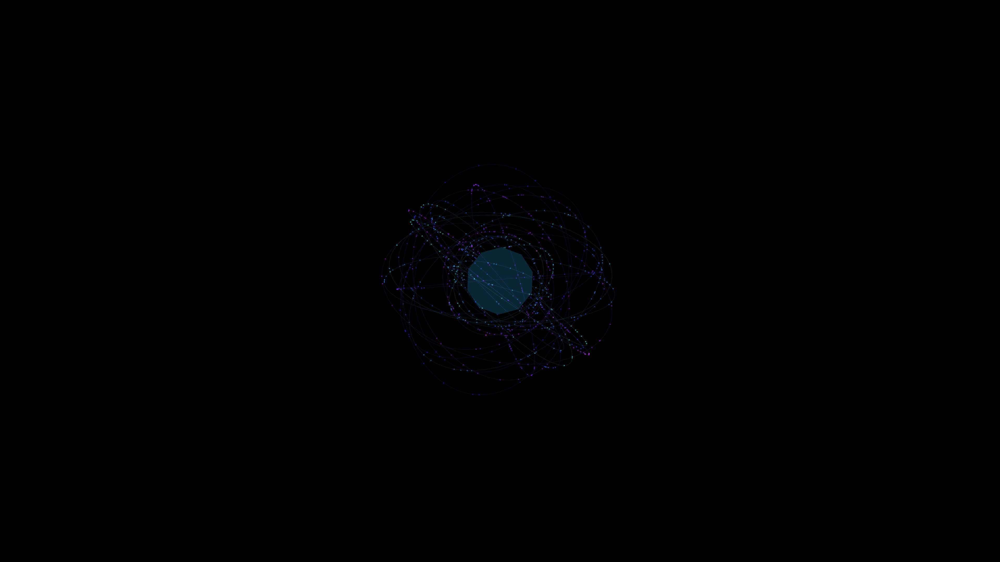

# cybernetic_holographic_data_sphere_3d

A floating holographic sphere made of spinning concentric data rings and particles.

## Details
- **Date**: 2026-06-20
- **Technique**: Concentric rings on different axes rotating at different speeds, dotted with glowing data points.
- **Format**: Animation (10s @ 60fps)
