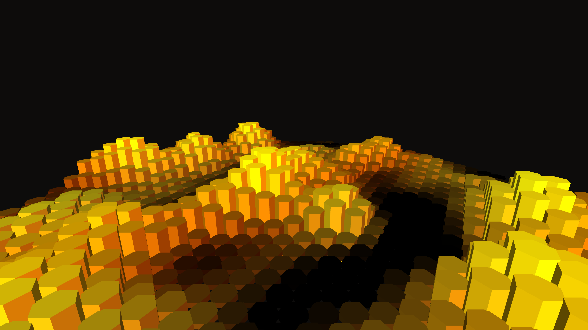

# cybernetic_honeycomb_hive_mind_3d

## Metadata
- **Date**: 2026-06-09
- **Theme**: An animated 15s simulation of a cybernetic honeycomb using 3D procedurally extruded prisms
- **Technique**: Unknown
- **Logic Lab Reference**: 

## Concept
An animated 15s simulation of a cybernetic honeycomb using 3D procedurally extruded prisms.

## Technical Details
- **Renderer**: Unknown
- **Simulation**: Unknown
- **Visuals**: Unknown
- **Animation**: Unknown
