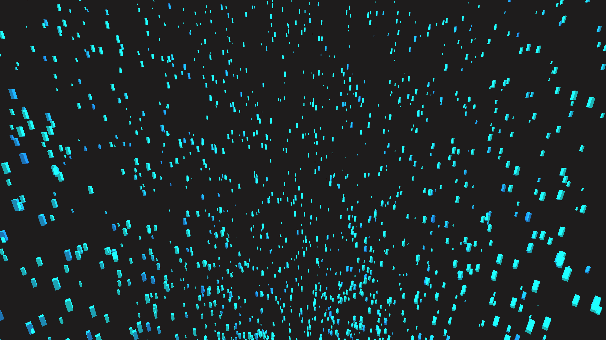

# cybernetic_hurricane_shard_vortex_3d

## Metadata
- **Date**: 2026-06-11
- **Theme**: An animated 15s sequence of a massive cybernetic hurricane funnel composed of glowing geometric shar
- **Technique**: A 3D particle system organized into a massive swirling funnel using cylindrical coordinates and Perlin noise for turbulence. The "ocean" below is a shifting wireframe grid. Additive blending with deep cyan and electric blue colors.
- **Logic Lab Reference**: 

## Concept
An animated 15s sequence of a massive cybernetic hurricane funnel composed of glowing geometric shards.

## Technical Details
- **Renderer**: Unknown
- **Simulation**: Unknown
- **Visuals**: Unknown
- **Animation**: Unknown
