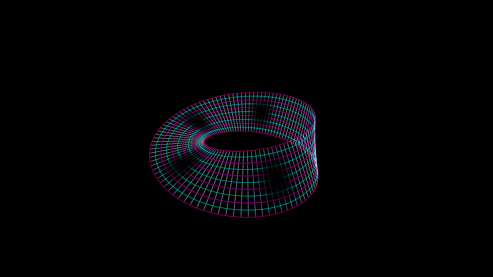

# cybernetic_mobius_hyper_racer_3d

## Metadata
- **Date**: 2026-05-31
- **Theme**: Generative Art
- **Technique**: 3D procedural generation of a Möbius strip using a parametric surface mapped to P3D with `py5.begin_shape(py5.QUAD_STRIP)`. The strip's edge coloring and opacity are animated using a high-speed sine wave flow to simulate pulsing data traveling at light-speed along the non-Euclidean loop.
- **Logic Lab Reference**: 

## Concept
No concept description provided.

## Technical Details
- **Renderer**: P3D
- **Simulation**: Unknown
- **Visuals**: Unknown
- **Animation**: Contains animation details
